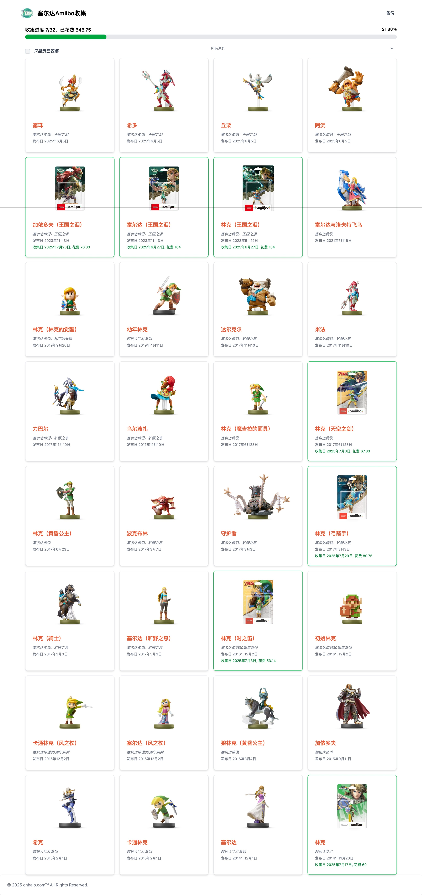

# Zelda Amiibo Collecting

一个用于展示和记录塞尔达系列 Amiibo 收藏进度的静态网站。

线上地址：[https://zelda-amiibo.cnhalo.com](https://zelda-amiibo.cnhalo.com/)



## 功能概览

- 展示塞尔达相关 Amiibo 图库。
- 在收集页查看总收集进度、已收集数量和累计花费。
- 按 Amiibo 系列筛选卡片。
- 只查看已收集 Amiibo，并按收集日期倒序展示。
- 点击图库图片可跳转到对应 Amiibo 的收集卡片。
- 在收集页导出当前收藏数据备份。

## 技术栈

- SvelteKit 2 / Svelte 5
- Vite 7
- TypeScript
- Tailwind CSS 4
- Flowbite Svelte
- Static adapter

## 快速开始

```bash
npm install
npm run dev
```

开发服务默认由 Vite 启动，脚本中开启了 `--host 0.0.0.0`。

## 环境变量

项目通过环境变量配置 Amiibo 图片资源地址：

```bash
VITE_AMIIBO_IMG_ENDPOINT=https://your-image-host.example.com
```

运行或构建前需要保证该变量可用，否则页面中的 Amiibo 图片地址会无法正确生成。

## 常用命令

```bash
npm run dev       # 启动开发服务
npm run build     # 构建静态站点
npm run preview   # 预览构建产物
npm run check     # Svelte/TypeScript 检查
npm run lint      # Prettier + ESLint 检查
npm run format    # 格式化代码
```

## 文档

- [项目说明](./docs/PROJECT.md)
- [数据维护指南](./docs/DATA.md)
